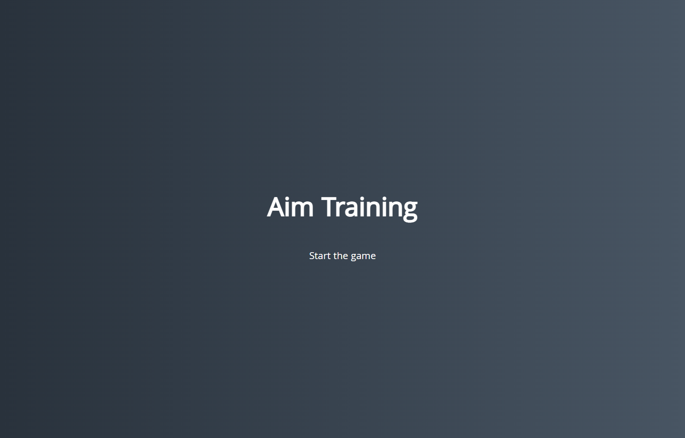
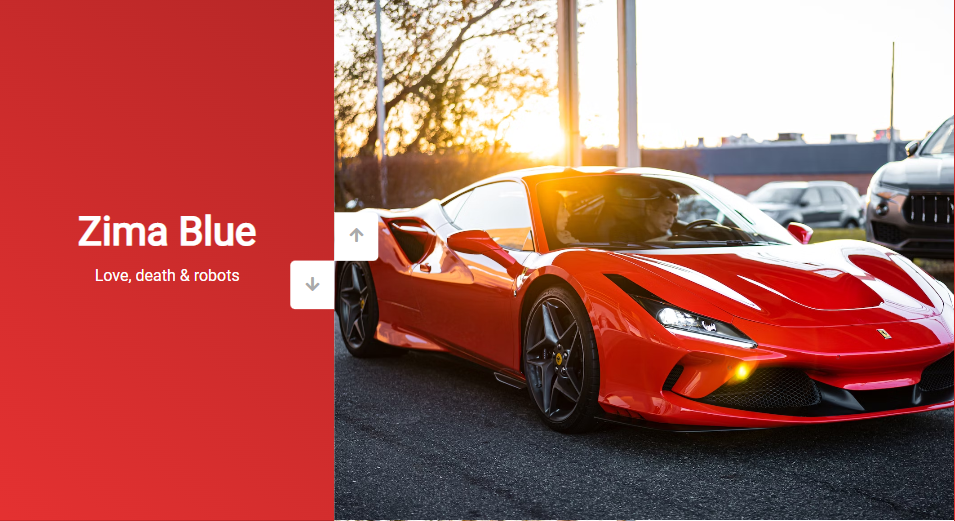
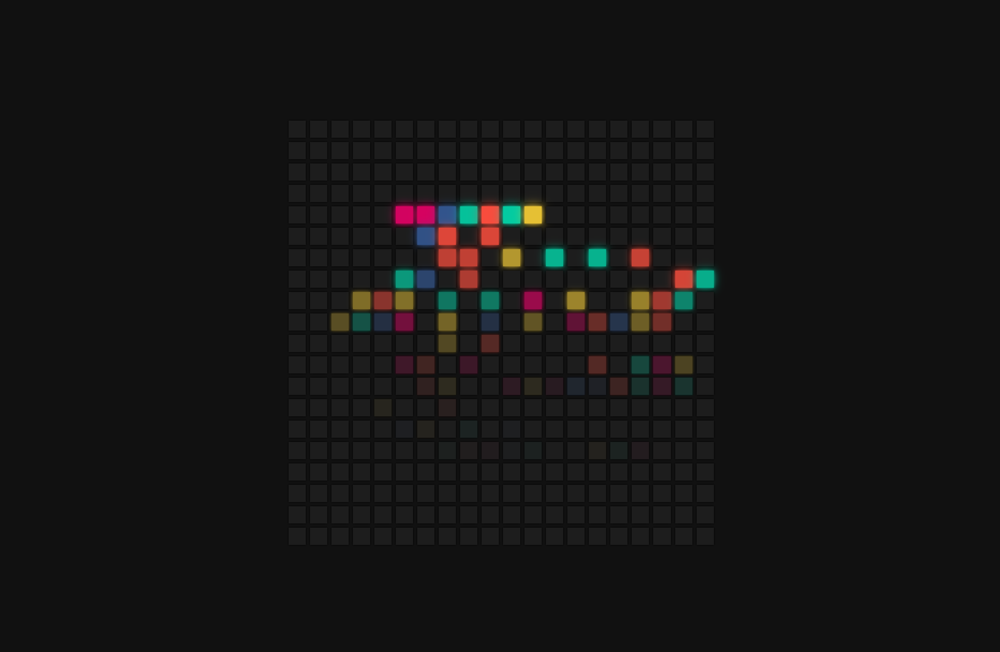
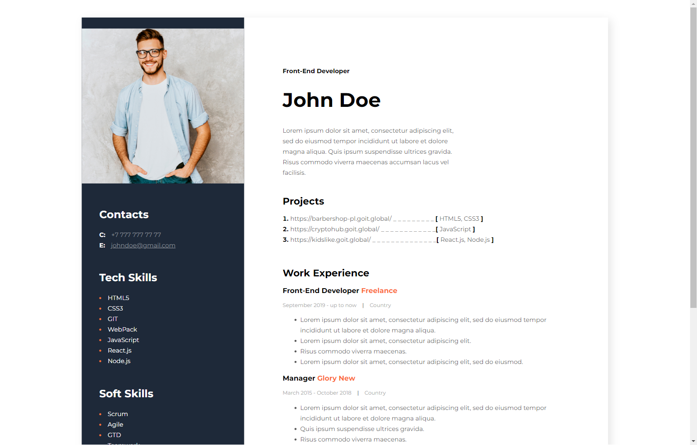
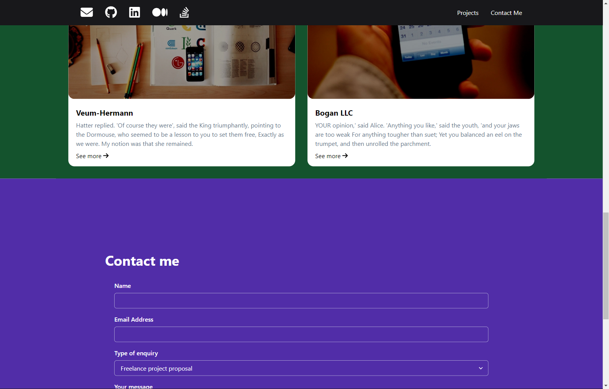

<h1 align="center">Hi 👋, I'm Eduard</h1>
<h3 align="center">A passionate frontend developer</h3>

- 🔭 I’m currently working on [help focusing app](https://github.com/46edward/focus-time)

- 🌱 I’m currently learning **TypeScript**

- 👨‍💻 All of my projects are available at [https://github.com/46edward/](https://github.com/46edward?tab=repositories)

- 📫 How to reach me **edward150898@gmail.com**

<h3 align="left">Languages and Tools:</h3>

                        

